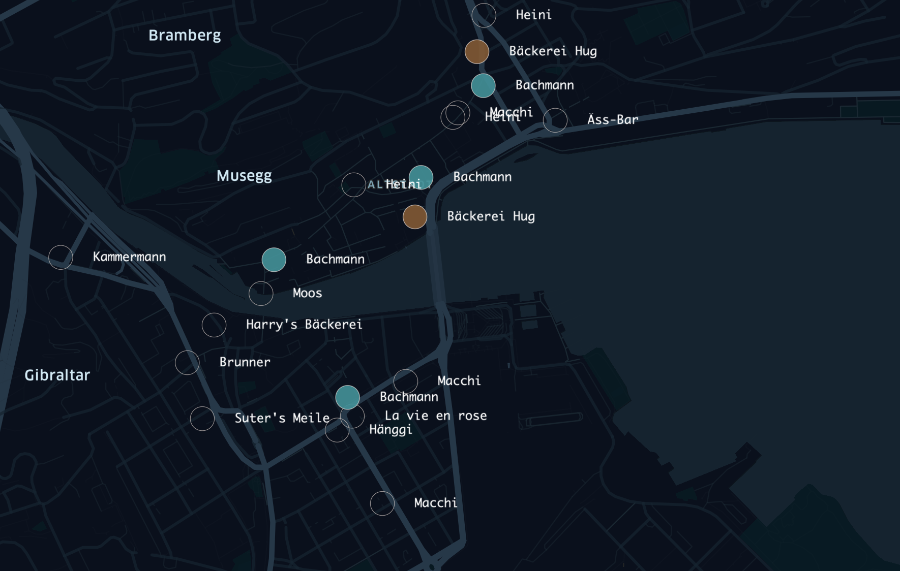

# HSLU Seminarwoche 2023

- Datengrundlage: OpenStreetMap Export [data/lucerne-bakeries.csv](data/lucerne-bakeries.csv)

## Tools

- Tabellenverarbeitung (z.b. Excel, Numbers, Libre Sheets, ...)
- Online GeoJSON Editor: [geojson.io](https://geojson.io) – [Mit rohem CSV](https://geojson.io/#id=github:cividi/hslu-seminarwoche/blob/main/data/lucerne-bakeries.geojson)

## Schritte im Detail

### Daten vorbereiten

1. [Overpass Turbo Abfrage](https://overpass-turbo.eu/s/1qvl) öffnen und ausführen
1. Export > GeoJSON Download

### GeoJSON nach CSV konvertieren

1. Auf geojson.io über Open > File exportiertes GeoJSON laden
1. Über Save > As CSV exportieren
1. CSV in Excel oder Google Sheets öffen (via Daten > aus Text laden bzw. Import)
   - Encoding / File Format: Unicode / UTF-8
   - Delimeter/Trennzeichen: Komma
1. Als .xlsx speichern zum späteren weiterbearbeiten

### Daten in Kepler öffnen

1. [kepler.gl](https://kepler.gl/demo) aufrufen
1. Auf "Add Data" klicken und GeoJSON oder CSV hinzufügen
1. Nach Bedarf filtern und stylen

## Weiterführende Links/Hintergünde

- Geo Tools:
  - [Overpass Turbo EU](https://overpass-turbo.eu) oder [Overpass Turbo CH](http://overpass-turbo.osm.ch) – OpenStreetMap Query-Interface & Export – [Bäckereiabfrage](https://overpass-turbo.eu/s/1qvk)
  - [Kepler](https://kepler.io)
  - [OpenStreetMap](https://openstreetmap.org) – "Wikipedia" der Karten
  - Schweizer Landeskarte [map.geo.admin.ch](https://map.geo.admin.ch)
  - [QGIS](https://qgis.org) – freies, open-source GIS
- Frictionless Data
  - [Frictionless Data](https://frictionlessdata.io)
  - [Official Data Package Creator](https://create.frictionlessdata.io)
  - [Spatial Data Package](https://github.com/cividi/spatial-data-package-spec)
  - [dføur Platform](https://github.com/cividi/spatial-data-package-platform)
