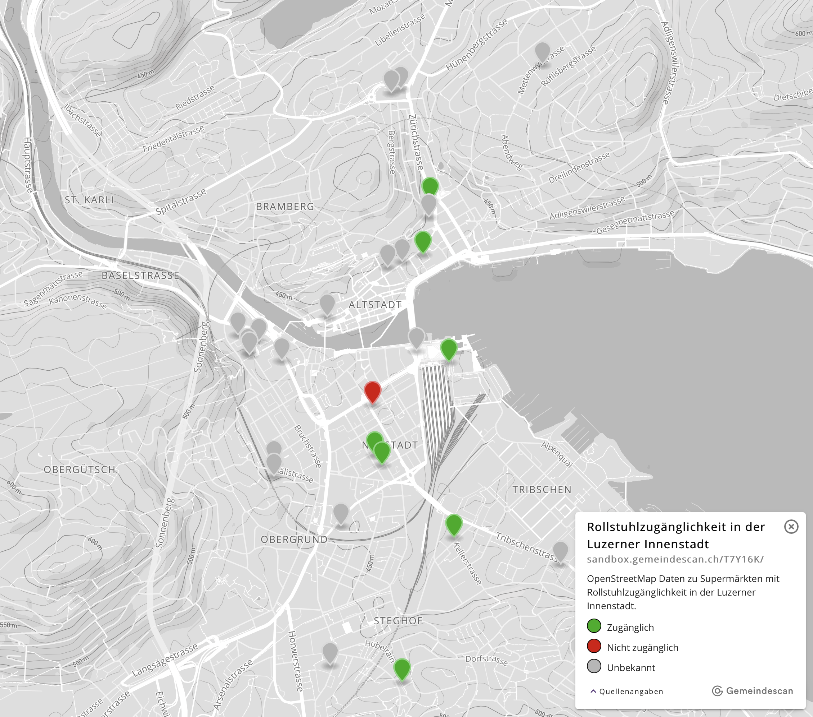

# HSLU Seminarwoche 2021

- Ziel: https://sandbox.gemeindescan.ch/de/IRMV1/T7Y16K/
- Datengrundlage: OpenStreetMap Export [data/lucerne-supermarkets.csv](data/lucerne-supermarkets.csv)

## Tools
- Tabellenverarbeitung (z.b. Excel, Numbers, Libre Sheets, ...)
- Online GeoJSON Editor: [geojson.io](https://geojson.io) – [Mit rohem CSV](https://geojson.io/#id=github:cividi/hslu-seminarwoche/blob/main/data/lucerne-supermarkets.geojson)
- Data Package Creator: [datapackage-ui.cividi.vercel.app](https://datapackage-ui.cividi.vercel.app) – [Vorbereitetes datapackage.json](data/datapackage.json)
- Gemeindescan Sandbox Workspace: [sandbox.gemeindescan.ch](https://sandbox.gemeindescan.ch/de/IRMV1/T7Y16K/)

## Ergänzte Spalten
- `title`: `=D3` oder jede andere Spalte, ggf. mittels `CONCAT` zusammengefügt
- `wheelchair_label`: `=IF(M2="yes","ja",IF(M2="no","nein","unbekannt"))`
- `description`: `=CONCAT("Rollstuhlzugänglich: ",N2)`
- `marker-color`: `=IF(M2="yes","#00AF00",IF(M2="no","#DC0000","#B6B6B6"))`

## Weiterführende Links/Hintergünde
- Geo Tools:
    - [Overpass Turbo](https://overpass-turbo.eu) – OpenStreetMap Query-Interface & Export – [Supermarktabfrage](https://overpass-turbo.eu/s/13se)
    - [OpenStreetMap](https://openstreetmap.org) – "Wikipedia" der Karten
    - Schweizer Landeskarte [map.geo.admin.ch](https://map.geo.admin.ch)
    - [QGIS](https://qgis.org) – freies, open-source GIS
- Frictionless Data
    - [Frictionless Data](https://frictionlessdata.io)
    - [Official Data Package Creator](https://create.frictionlessdata.io)
    - [Spatial Data Package](https://github.com/cividi/spatial-data-package-spec)
    - [Gemeindescan Platform](https://github.com/cividi/spatial-data-package-platform)